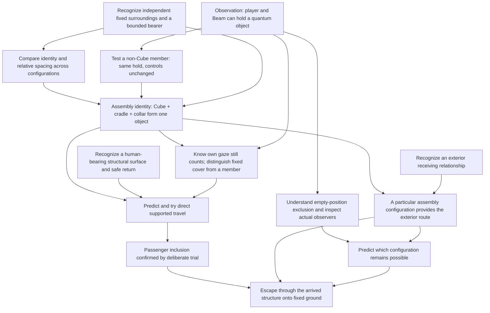

# Coherent Assembly Mystery Readability Audit

TASK-032.5 — design only. **REVISE before implementation remains the recommendation.**

Read against [the mystery framework](CORE_MYSTERY_AND_KNOWLEDGE_FRAMEWORK.md), [the law contract](COHERENT_ASSEMBLY_LAW_CONTRACT.md), and [the proposed roadmap](RECOMMENDED_DEVELOPMENT_TASKS.md). TASK-032's narrower rigid-assembly model takes precedence over earlier suggestions of independently changing architecture.

This is a desk audit of what evidence could support a player's inference. No assembly investigation space exists to playtest, and no human discovery or emotional response has been measured. Proposed evidence below is a constraint on the already proposed apparatus and its placements, not a new room, mechanic, facility expansion or evidence map for TASK-033.

## 1. Assessment

The revised mystery has a plausible discovery path, but its current descriptions do not establish that players would find it.

The strongest potential revelation is **a mistaken boundary**: a frame the player classified as fixed architecture belongs to the same object as the Cube. The weakest version is a recognizable transport platform that happens to move while nobody looks at it. Both can implement identical laws; only the former asks the player to reinterpret their surroundings.

Three distinctions must survive without explanation:

1. **Shared motion versus shared observation.** Moving together could mean an ordinary lift, a machine carrying a specimen, or a scripted room swap. Observation of a non-Cube structural member must change the player's prediction.
2. **The travelling structure versus its fixed surroundings.** Familiar stationary references must remain recognizable across comparisons. Otherwise the player cannot tell whether the apparatus, the room or their own camera moved.
3. **A credible reason to board versus proof that boarding works.** Secured equipment and human-scale construction invite the experiment. Only a safe, repeatable personal experiment establishes that an unrestrained supported player travels too.

The design should invite the question **“Why is that familiar frame somewhere else?”** before it asks the player to operate a transport device. It should support that question even if the player never reads a record.

## 2. First impression: plausible misconceptions

Assumed knowledge is limited to Awakening's observation rule and player/Beam observation. Do not assume the player knows assembly membership, passenger inclusion, the meaning of every empty berth, or the distinction between holding a current state and excluding a destination.

The order below is not a required learning sequence. A player may keep several explanations at once.

| Hypothesis | Why it appears reasonable | Evidence that supports it initially | Evidence needed to challenge or refine it | Effect on the mystery |
| --- | --- | --- | --- | --- |
| **“It is a normal elevator.”** | A load-bearing deck, nearby machinery and receiving openings imply transport | Rails, a cab-like enclosure, repeated identical landings or an obvious operating station would reinforce this strongly | From fixed ground, observe before/after placement without operating a transport control; discover that watching only the collar holds the whole structure and that an empty observed location cannot receive it | Useful initial expectation if later contradicted. Harmful if “press control, take ride” predicts every meaningful outcome |
| **“The Cube controls a machine.”** | A special object mounted in equipment resembles a power source, key or actuator | Cube-centred lighting, a pedestal-like mounting, power cables or a machine response after Beam power changes | With instrument settings unchanged, direct gaze at an integrated frame holds the configuration while the Cube itself is hidden; gaze at an independent wall does not. Continuous bearer and repeated identity support one object | A particularly useful wrong model: it transfers prior knowledge but makes the Cube too privileged. It becomes destructive if every decisive event follows a power switch |
| **“A hidden switch changes destination.”** | The player turned, walked or interacted before noticing a change | A change first noticed after crossing a threshold, repeated mandatory control use, or inconsistent-looking delays | Revisit the same standing position with no interaction or threshold crossing; compare views of a participating member and independent fixed cover while other observers and alternatives remain equivalent | A testable early hypothesis. Persistent belief in invisible triggers destroys experimentation because the player stops trusting observation |
| **“The room teleports.”** | A different connection or view appears after looking away | Identical receiver interiors, missing stationary references, transition cuts or a whole scene's dressing seeming to change | The same fixed wall, floor and sightline remain while a particular recognizable frame/deck is absent or at another berth; compare from fixed ground before any ride | Useful overestimate of the object's size. Harmful if the design actually removes the references needed to correct it |
| **“The entire building moves.”** | Large architectural change is easier to explain globally than by unfamiliar boundaries | Opaque layouts, unexplained route changes or every visible landmark seeming displaced | Stable building features and an existing outside reference retain their relationship while the bounded assembly changes relative to them; trace the physical docking separation | Can create productive uncertainty briefly. It overpromises a different mystery if allowed to remain the best explanation |
| **“Some parts are connected.”** | Joints, repeated geometry and coordinated changes suggest linkage | Visible structural continuity and equipment preserving spacing | Refine what “connected” means: an integral collar holds the same assembly; a flexible cable, nearby machine or receiving floor does not join it. Compare identity across placements | Productive partial understanding. It fails if similarity, any cable or any physical touch appears to imply shared membership |
| “It is a scripted event, not a stable phenomenon.” | Many games stage a first disappearance and then stop responding | A unique dramatic reveal, unexplained refusal to repeat, or dependence on entering an area | Voluntary repeat and recall using the same ordinary observations; durable evidence remains available after the first event | Destructive if persistent. A spectacular first event cannot substitute for repeatability |
| “Standing here or facing this wall activates it.” | Boarding and turning are followed by travel | A tiny privileged standing spot, unusually highlighted hood or exact look angle | The same release works empty; a watched member or active Beam still holds it while boarded; broad physically valid support and cover explain the difference | Destructive if it reduces discovery to finding a trigger spot. Avoid making the release posture resemble a command |

These are hypotheses about likely interpretations, not observed player behavior.

### Useful error versus damaged trust

A useful error leads to a concrete experiment: “If the Cube alone controls this, hiding it should be enough.” A destructive interpretation makes experiments pointless: “The game decides when I am allowed to go.”

Do not insist on vocabulary. A player calling the apparatus a “quantum elevator” may understand every relevant relationship. A player reciting “coherent assembly” may understand none. Judge whether they predict what happens when only the collar is observed, whether they know which surroundings stay fixed, and why they board.

Nor can finite evidence disprove every imagined hidden controller. The aim is a compact model that makes better predictions across new observations, not a philosophical proof that the game contains no secret switches.

## 3. Minimum assembly identity evidence chain

Target inference:

> The Cube, cradle and collar are one object for observation and relocation; the receiving floor and surrounding wall are not.

The minimum chain needs **a boundary, a comparison, and a causal distinction**. Bolts and matching damage cannot carry it alone. Neither can repeated immobility: if an unseen Beam or observed candidate already prevents movement, that immobility proves nothing about the collar.

The items below describe evidence roles within the proposed apparatus. They are not steps enforced by triggers or visitation order.

### Immediate evidence: available by inspecting one configuration

| Evidence | What the player can notice | What it permits them to suspect | What it cannot yet prove |
| --- | --- | --- | --- |
| One traceable bearer joins the Cube mounting, walking deck and collar | The structure can be followed visually around a corner or inspected from the side; joints continue through the three parts | The apparent frame and specimen mount may belong together | That the group obeys the Cube's observation rule |
| A readable docking break separates that bearer from the surrounding building | Independent floor/foundation and a mechanical receiving gap remain legible at normal player height | There is a bounded structure inside the larger facility | Which configurations are possible |
| A distinctive structural feature belongs to the bearer | For example, an asymmetric bracket paired with a repaired fracture at a joint, readable as part of the equipment | A recognizable identity to compare later | That an unseen move occurred rather than a replacement |
| A stable, ordinary reference is visible nearby | Fixed wall damage or a fixed window's relationship to outside structure | A reference for noticing what stays put | Passenger inclusion or an exterior route |

Only a few features are necessary. Do not add a field of matching symbols, color-coded joints or glowing scars. Ordinary material contrast may aid visibility, but membership must survive without color as a code.

First-visit curiosity should arise from a physical mismatch: the collar reads like part of the building from the approach, yet its underside or joint visibly belongs to the same bearer as the Cube. This evidence must be accessible immediately, even if a player overlooks it at first. Discovery must not depend on later adding a seam that was previously absent.

### Delayed evidence: comparison after another configuration

“Delayed” means a comparison across configurations, not a mandatory later wing or visit.

1. **The old place becomes meaningful.** From fixed ground, the player can recognize the same surrounding architecture and the now-vacant receiving contact. This supports “a bounded part changed” instead of “my whole room was replaced.”
2. **Identity survives the change.** At another allowed placement, the asymmetric feature, joint damage and relative Cube–deck–collar spacing match. The player compares a rigid structure, not independent components newly arranged to suit a puzzle.
3. **Apparent architecture participates in observation.** A view of only an integrated collar can hold the same structure, even when the Cube is hidden. A view of only independent fixed cover does not. This revises “Cube controls machinery” into “this frame is part of the observed object.”
4. **The corrected model predicts another result.** The player can choose to keep the assembly present through a different visible member, or recognize why another member must also be concealed to allow release. This prediction matters more than repeating a successful route.

The first two observations supply identity. The third supplies the shared quantum relationship. The fourth distinguishes discovery from acceptance of a striking scene.

### Conditions that make the comparison diagnostic

These are authoring checks, not instructions to display to the player:

- The comparison can be made without pressing a control or crossing a trigger boundary each time.
- At least one complete alternative is legal and hidden; the player is not unknowingly observing all destinations.
- Other current observers are accounted for and remain equivalent across the comparison.
- Each comparison starts with a real observed/released opportunity; a previously consumed release cannot masquerade as a successful collar hold.
- Fixed cover conceals the entire participating body/payload envelope, including direct edges and silhouettes. [TASK-034.3](OBSERVATION_EVIDENCE_CONTRACT_REVIEW.md) distinguishes cast-shadow evidence: it does not observe, and conspicuous watched discontinuities require a separate actual-light presentation check.
- Comparing two views from a suitable fixed position changes which current parts are seen without accidentally changing the candidate constraints that explain the result.
- The decisive non-Cube example is a clearly integrated structural member, not ambiguous loose cargo.
- A reference in fixed surroundings remains recognizable on return.

A Beam can help hold a non-Cube member while the player inspects the rest, but toggling that Beam alone is weak evidence against “power controls machine.” At least one comparison must rely on direct sight with the source settings unchanged.

The player cannot watch a lawful relocation. Before-and-after comparison is required; a visible transforming doorframe would teach the wrong rule. No scene cut, blackout, camera turn or cutscene should supply an otherwise missing causal link.

If the future paper geometry cannot support a readable comparison with these conditions, the minimum chain is incomplete. Do not repair it by adding a sign that says “all parts are entangled.”

### Corroborating evidence: confirms rather than teaches

- Fixed docking wear fits the bearer feet in another placement, suggesting the configuration has a history.
- A restrained load preserves its relation to the carrier, increasing confidence that a larger object travelled.
- Ordinary service connections and disconnected receiving hardware reveal why that placement had a facility function.
- Old wear follows the portable frame while independent environmental wear stays with the building.
- Optional records can account for past use after the player can already recognize what the account refers to.

A strapped load supports “things attached to this structure go with it.” It does **not** establish the stronger proposal that an unrestrained person qualifies by standing on it. Treating this as proof would import the design document's reasoning into the player's experience.

A single unusually legible configuration change may compress this chain into one visit. Do not require extra cycles to manufacture mystery or ten-minute pacing.

## 4. From identity to passenger inclusion: the weak connection

Knowing the boundary does not automatically give the player a reason to step onto a machine that disappears. Passenger discovery needs an invitation to investigate, a plausible hypothesis and a reversible experiment.

Within the already proposed cradle and berths:

- Make the deck visibly capable of ordinary human support, with a broad, accessible step from independent floor. Do not turn it into a glowing boarding pad.
- Give the player a reason to inspect a structural detail from the deck—for example, the inward-facing side of a familiar joint—without needing to operate a “travel” control. This is a placement criterion for existing evidence, not a new collectible or interaction.
- Make the nearby independent hood/wall physically distinguishable from the moving bearer. Normal looking must be able to conceal the full assembly while the player stays supported.
- Make the internal receiving placement and fixed return access inspectable enough that the proposed experiment does not read as an irreversible death gamble.
- Preserve the supported player's relative relation to the bearer and a recognizable difference in the independent surroundings after arrival.
- Permit a deliberate repeat after the player has noticed an accidental first ride. An accident can prompt curiosity; it is not yet evidence of understanding.

Human wear on a deck and carried equipment can suggest former use. Neither should spell out the maneuver. The decisive result is the player intentionally comparing **on the structural deck** with **safely on independent floor**, while understanding whether their own gaze or a Beam still holds the apparatus.

The law review's risks remain unresolved: indirect support through a strapped crate, partial support and prospective camera-safety rejection can all look arbitrary. This audit does not create a different support rule. Avoid using such borderline cases as the first evidence of passenger inclusion; they still require the separate validation demanded by TASK-032.

If ordinary curiosity never makes a supported trial seem plausible without a facilitator saying “stand there and look away,” passenger readability has failed. More historical prose would not solve that failure.

## 5. Avoiding the quantum elevator problem

**The risk is high.** The proposed mechanism transports a rider between fixed placements. Its observable function overlaps with a teleporting lift, and environmental styling cannot erase that.

The achievable distinction is that the player revises what they believed was fixed architecture and recognizes how it relates to possible routes. Making a lift look more mysterious is insufficient.

| Existing proposal to adjust later | Recommended architectural/evidence treatment | Intended reinterpretation | Guardrail |
| --- | --- | --- | --- |
| Collar and cradle | Let the collar initially read as a service threshold belonging to the facility, while its structural connection to the bearer is available on inspection | “That part of the building belongs to the thing that moves” | Do not falsely bolt it into fixed walls or hide the boundary until a story event |
| Receiving berths | Give placements different functional relationships to the same fixed structure: internal service access, internal receiving space, exterior landing | “These are different ways this piece fits the facility” | Do not make new rooms, change internal member spacing or remap a doorway behind the player's back |
| Fixed surroundings | Retain an identifiable fixed floor/wall/window relation across comparisons | “The surroundings are still here; the frame changed relative to them” | No full-scene replacement or unmotivated camera discontinuity |
| Former use | Put existing-style wear where feet, loads, joints or maintenance contact would actually occur | “People used these relationships before the abandonment” | Wear can imply use; it cannot prove exactly who escaped or why |
| Exterior receiving evidence | Make the known bearer shape and contact geometry fit an already proposed exterior landing visible from fixed space | “This absent connection already has a place outside” | Fit alone suggests possibility; an empty exterior arrival and recall can confirm identity before a passenger attempt |
| Instrument station | Expose the actual observation field and its target relation; keep it visually subordinate to the structural puzzle | “That instrument holds or excludes this placement” | The power control must not look or behave like a destination selector |
| Fixed cover | Use believable independent service shielding with generous viewing freedom | “I can stop seeing the structure without leaving its support” | No conspicuous blank-wall target, compulsory exact pitch, or moving hood treated as non-observing |

The same damaged collar must change its relation to fixed openings because the **entire rigid assembly** moves. A corridor must not connect elsewhere because a designer swapped its destination. This audit recommends no additional articulation, remote coupling or topology rule.

### Four checks against a merely decorative mystery

1. **Ordinary-lift substitution.** If a conventional lift and floor selector could replace the observation relationships without changing what the player has to understand, the mystery has not acquired the intended identity insight.
2. **No-records check.** With explanatory documents and labels removed, can physical comparison still support shared identity, a passenger hypothesis and the exterior inference?
3. **No-arrival-spectacle check.** Before taking the final ride, can the player say what they expect will stay with them and what will change? Surprise consisting only of an unexpected exterior vista is a transport reveal, not world reinterpretation.
4. **New-view prediction.** Can the player recognize that a previously untested visible member would still hold the assembly? Memorizing one wall-facing posture is insufficient.

These are proposed evaluation criteria, not tests already conducted.

Calling the mechanism a lift is not itself failure. Failure is when knowing it is a lift is sufficient and none of the facility's previously observed relationships acquire a different meaning.

## 6. Awakening compatibility

Awakening establishes a true case: observing a quantum object affects whether it can relocate. Later proposed content extends the **size and boundary of some objects**, not the validity of that experiment.

| Earlier evidence | Later evidence may establish | Later content must not imply |
| --- | --- | --- |
| Opening Cube stays when observed and moves after an eligible release | A visibly integrated structure is a larger object governed by the same observation principle | The opening movement was staged or a different hidden rule applied |
| Opening Cube appears as a bounded specimen | Another Cube can be a structural member rather than an isolated specimen | The opening Cube always moved unseen walls or an undisclosed chassis |
| Player vision and Beam count | Either can hold any participating member; the visible Cube is not the sole relevant surface | Boarding makes the player's vision stop counting |
| Looking away or real occlusion removes direct observation | A larger envelope requires accounting for the collar and cradle as well | Switching ordinary lights off is newly equivalent to not observing |
| Ordinary scenery remains ordinary scenery | A specific frame's inspectable physical construction and behavior show membership | Every frame, similar material or cable in Awakening was secretly quantum |

Recommended author-facing wording:

> The opening experiment was correct. I had mistaken the boundary of a later object: some of what looked like the building belongs to the same structure as its Cube.

A plausible player paraphrase is: **“It works like the Cube, but that frame is part of it too.”**

Avoid “the Cube was never moving,” “the first room was a lie,” “everything here is quantum,” or “you were inside the assembly from the moment you woke up.” None follows from the preserved content or the rigid-assembly proposal.

This wording is for design assessment and optional after-play discussion. Do not install it as tutorial text, a required record, or an ending explanation.

Keep “similar technology” distinct from “same object.” Construction resemblance can invite investigation of a later integrated Cube; only its visible bearer and behavior establish its membership. The original singleton need not be retrospectively coupled to anything.

## 7. Final revelation: surprise, reinterpretation and payoff

Proposed thought:

> “I was not trapped inside a building with no exit. I was inside a transport structure whose possible exit configuration I had never recognized.”

### Scope problem in the wording

The second sentence overstates the current design if “I was inside” means Awakening, the whole hub or the entire facility was the travelling assembly. TASK-032 deliberately preserves a fixed building and proposes bounded structures inside it.

The thought is supportable if it refers to the apparatus the player has now identified and boarded. It is not supportable as a literal account of the whole opening experience.

A more defensible intended realization is:

> What I took for fixed architecture is the way out. Its outside placement already exists. I can go with it.

The broader mystery can be “this facility was built to use these possible connections,” without claiming that every room is one relocatable object.

### Payoff assessment

| Intended effect | What could produce it | What would weaken it | Current assessment |
| --- | --- | --- | --- |
| Surprise | A familiar service frame belongs to a quantum object, and can place the player at a previously recognized outside connection | An unmistakable teleport cab announces both purpose and outcome on entry; alternatively, an unforeshadowed outside vista supplies the entire surprise | Plausible, conditional on first impressions and comparison |
| Reinterpretation | The player recalls a specific missing frame, an apparently pointless receiving surface, or an observer directed at an empty berth and now explains it | The player merely learns an extra feature of a newly encountered machine | The strongest potential payoff, but it needs earlier misclassified physical evidence |
| Emotional payoff | The player trusts a hypothesis enough to make a voluntary journey; earlier evidence suggests that people used the facility rather than simply vanishing by authorial decree | A prescribed sequence, a forced ride, an inexplicable refusal to move, or a cinematic explanation after success | Possible agency and relief; intensity cannot be established by desk review |
| “I already had what I needed” | Observation, support, existing source controls and receiving architecture were available before the conclusion | A final-only activation prompt, discovery flag or freshly created exterior landing | Supported by the proposed law, not yet demonstrated by content |

### Evidence needed before the final commitment

- A familiar architectural member has already been reidentified as part of the assembly.
- The player has a stable reference for what stays with the building and what travels.
- An exterior receiving relationship has been visible as a physical question before it becomes the answer.
- That receiving relationship has enough distinctive correspondence to support C; generic matching platforms are too weak. A lawful empty placement and recall can corroborate it.
- A supported personal trial has been possible in a safe, returnable configuration; the finale is not the first place the rule is silently applied to the player.
- The player has had an opportunity to distinguish current-state holding from exclusion of an empty alternative.
- The relevant actual Beam states and fixed cover can be inspected. No successful clue read secretly prepares them.
- At least one earlier consequence now makes more sense: a collar thought to be part of a wall, receiving wear at an inaccessible location, or a Beam apparently watching nothing.

“Before” means available to encounter, not verified by a completion flag. A player who infers the result earlier may proceed.

The final experience should let the player recognize the relationship, not demand a prescribed sentence. An emotionally quiet but deliberate exit may demonstrate the mystery more convincingly than a dramatic reveal whose operation remains unexplained.

### Execution stays simple

Retain TASK-032's proposed normal case: an existing field excludes the internal alternative, current inspection is removed if necessary, the player boards while observing, conceals the whole assembly using fixed cover, and steps off after arrival.

Identification of C is understanding, not a separate control task. Waiting is automatic. Reobservation is ordinary looking, not a required final timing gesture.

An accidental legal exterior arrival remains valid. Completion alone does not prove that the player experienced the revelation; neither should the game reject it for lacking a correct interpretation.

## 8. Player knowledge dependency graph

This graph describes dependencies between justified inferences, not area order, scripted beats or hidden unlocks. The player starts at O. Their knowledge of Beam observation is a starting resource; empty-position exclusion should be verified rather than assumed.

The exterior relationship may be noticed before assembly identity or passenger inclusion. Its meaning becomes clearer later. Passenger inclusion is required to plan personal escape, not to notice an outside receiving structure. Do not force the graph into a single vertical teaching sequence.

### Missing intermediate discoveries

| Gap in the simple chain | Required intermediate insight | Why skipping it harms discovery |
| --- | --- | --- |
| Observation → assembly identity | A non-Cube structural part can hold the same phenomenon | Otherwise “Cube runs a machine” remains sufficient |
| Changed surroundings → identity | Fixed references persist, while distinctive member relationships travel | Otherwise room replacement, player teleport or whole-building motion explain the change equally well |
| Connected parts → bounded object | An integral bearer differs from cables, docks and adjacent floor | Otherwise membership becomes an invisible designer tag |
| Assembly identity → passenger inclusion | There is a physically credible, directly supported place to stand and a safe reason to experiment | Knowing that objects move together does not prove an unrestrained person can ride |
| Boarding → lawful release | The passenger is still an observer, and only independent cover removes their view without leaving support | Otherwise the player searches for an activation posture or assumes a failed switch |
| Generic relocation → chosen outcome | Observing an empty complete placement excludes it; source states remain real and inspectable | Otherwise the finale is a lucky ride or a hidden destination selection |
| Identity → exterior configuration | The outside receiver corresponds to this same bounded structure, not merely similar technology | Otherwise C is a designer-promised destination or an arbitrary leap |
| Personal transition → escape | Arrival preserves a recognizable relation to the carrier and offers independent safe ground | Otherwise a changed view can be mistaken for a camera trick, trap or temporary scripted sequence |

Recalling and reobserving the actual resting assembly support these experiments. They are practical enabling knowledge, not additional fundamental laws. If the apparatus has already consumed its release opportunity, the player must be able to find or observe it again without a designer reset.

## 9. Readability blockers inherited from TASK-032

The audit must not use environmental language to pretend unresolved contract details are already intuitive.

| Blocker | Likely player interpretation | Constraint for the next design work |
| --- | --- | --- |
| A held result has several unseen possible causes | “Watching the collar worked” may be a false conclusion when a Beam or candidate exclusion already held it | Provide a diagnostic comparison in which the changed observation is the meaningful difference |
| Full support versus nearby/indirect support is not readable | “It only works on the designer's spot” | Use a broad, plainly structural first boarding surface and independent floor; validate border cases separately |
| Prospective camera-safety rejection | “The destination sometimes refuses me for no reason” | Proposed receiver cover must make the extra veto irrelevant to ordinary discovery; do not teach it as another secret rule |
| Identical fixed hoods at different berths | “The scene loads when I face a blank wall” | Before/after fixed references must be inspectable; do not frame the hood as the destination-selection device |
| No distinctive identity beyond a matching Cube | “There are several copies or platforms” | Establish one memorable shape relationship plus one physical wear/joint relationship; avoid relying on material alone |
| Large envelope is difficult to hide | “The observation rule stopped working here” | Cover and candidate states must allow comfortable, repeatable release without exact camera aiming |
| Facility-wide language exceeds bounded mechanics | “The whole map should shift when I look away” | Keep demonstrations and mystery wording about specific structures and their connections |
| Human history is inferred too confidently | “A log told me the answer” or “there is no evidence people used this” | Physical human-scale use supports purpose; exact fate and intent stay optional historical interpretation |

These are reasons to retain REVISE, not invitations to add a mechanic, explanatory UI or another teaching chamber.

## 10. Required revisions before TASK-033

Only this audit document is delivered now. The following changes are requirements for the next design brief, not a completed incident/evidence map or permission to start it.

| Priority | Revision required in the brief | Acceptance evidence |
| --- | --- | --- |
| 1 | Set the revelation's scale to bounded apparent architecture, not the entire building or Awakening's original Cube | The proposed final thought is true of the actual demonstration without retroactive hidden membership |
| 2 | Make one non-Cube structural member initially readable as architecture, with its real boundary available on inspection | A plausible first impression and later reclassification use the same unchanged physical evidence |
| 3 | Specify the minimal diagnostic chain: boundary, identity comparison, non-Cube observation, new prediction | Remove all explanatory records and the chain still offers a reason to revise “Cube controls machine” |
| 4 | Identify the fixed reference and the travelling signature for each essential comparison | A player can tell what moved without seeing a forbidden transition or accepting a scene cut |
| 5 | Provide a curiosity-driven passenger hypothesis distinct from proof by secured cargo | An intentional, safe support experiment is conceivable without “stand here and look away” instructions |
| 6 | Establish exterior receiving evidence before final transport | The outside route is a previously interpretable spatial relationship, not an ending-only destination |
| 7 | Show how actual observer states can remain simple at the finale | Persistent Beam coverage has a physical purpose and can be inspected/changed; no clue flags or added control choreography |
| 8 | Carry forward support, concealed-arrival and recovery risks explicitly | No first-discovery evidence depends on an unexplained candidate rejection or inaccessible recall |
| 9 | Define comprehension by predictions and reinterpretation, not terminology or completion | “Quantum elevator” with correct predictions can pass; “coherent assembly” without them does not |

### Questions a later unbriefed evaluation must resolve

Observe curiosity first. Do not introduce terms such as “assembly” or tell participants which part to test. After their own investigation, neutral questions can include:

- What do you think changed? What do you think stayed where it was?
- What would you inspect or try next, and what would each possible result tell you?
- What do you expect will happen if you repeat that action from here?
- Why do you expect that outside location to be reachable?
- Which earlier thing looks different to you now, and why?

A useful outcome is a player choosing a discriminating experiment, predicting shared observation through a non-Cube member, and linking a previously puzzling architectural feature to personal escape. A successful ride without those inferences is ambiguous. An exact repetition of a facilitator's explanation is not discovery.

These questions are audit criteria for later work. No participant sessions have occurred here; no success rate or emotional payoff is claimed.

## 11. Verdict

**REVISE before implementation.** There is a credible mystery in mistaking the boundary of a quantum object and then recognizing the facility's existing connections. There is not yet evidence that this will be discovered unaided.

The deciding question is whether players can say, in their own terms, **“That part of the building is part of the object, and I can use its other placement”** before an ending explanation supplies it.

If they understand only that a platform transports them after a control action, the proposed revelation has not been achieved—even if every rule and collision check is correct. Address that through the evidence and spatial relationships above. Do not expand the rule set to compensate.

TASK-033 remains unstarted. No scene, mechanic, facility content or previous design document is changed by this audit.
