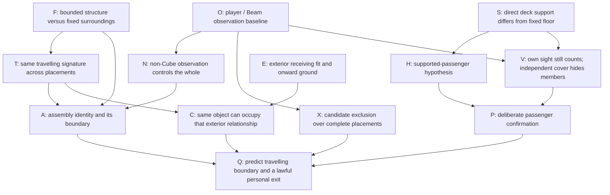

# TASK-037 — Connected Exploration and Evidence Distribution Plan

**Verdict: GO TO CONNECTED GREYBOX.** This is a design-readiness decision for a later, separately authorized task. It is not a finding that the future facility is built, comfortably traversable, or understood by players. Human mystery readability remains **UNVALIDATED**. No unbriefed sessions occurred.

## 1. Scope, sources, and trusted starting point

One abandoned workplace surrounds one bounded anomaly. The player can inspect it from different jobs' working positions, leave a question unresolved, and return with a better experiment. Records, Power, Containment, and Signal are functions of that workplace, not four challenges whose completion enables a finale.

The intended reinterpretation is: “The frame I took for the building belongs to the object. That familiar outside receiving structure can receive it, with me aboard.” Awakening and the Operations Atrium remain fixed and truthful. Neither was secretly part of a moving building.

Source basis:

- [TASK-036 configuration/access plan](TASK036_FACILITY_CONFIGURATION_AND_ACCESS_PLAN.md): authoritative measured current-world anchors and proposed fixed circulation, A/B/C, observation, support, and recovery geometry.
- [World layout and discovery flow](WORLD_LAYOUT_AND_DISCOVERY_FLOW.md), [evidence architecture](EVIDENCE_ARCHITECTURE_AND_MISINTERPRETATION_MAP.md), and [readability audit](COHERENT_ASSEMBLY_READABILITY_AUDIT.md): occupational overlap, E1–E6, mistaken boundary, and causal rather than lore-first discovery.
- [Law contract](COHERENT_ASSEMBLY_LAW_CONTRACT.md) and [TASK-035 feasibility](TASK035_COHERENT_ASSEMBLY_FEASIBILITY.md): rigid membership, complete observation/candidate envelopes, direct support, actual reobservation, and technical/manual limits.
- [TASK-034 spatial proof](TASK034_SPATIAL_PROOF_AND_DECISION_GATE.md): diagnostic comparisons and early-escape requirements; its historical coordinates and rounded-deck concealment certificate are not this layout.
- [Core mystery framework](CORE_MYSTERY_AND_KNOWLEDGE_FRAMEWORK.md): research purposes and human-scale context, narrowed by the later bounded-assembly decisions.

Current source inspection includes [Awakening](../../scenes/world/opening/awakening_chamber.tscn), [Operations Atrium](../../scenes/world/hub/operations_atrium.tscn), [sealed approaches](../../scenes/world/hub/sealed_wing_approach.tscn), [opening service logic](../../scripts/world/awakening_chamber.gd), and [hub restoration](../../scripts/world/hub_restoration.gd). F5 still names Awakening. Its service handle supplies the Beam and load interlock; the powered release interaction opens the bulkhead permanently. It is not the historical single-handle exit, and no further restoration signal is proposed here.

Awakening now supplies experience with player observation, Beam observation, current stabilization, and candidate exclusion. Assume only the approximate remembered model “the Beam is another observer,” not perfect verbal understanding. Older documents' Beam-free opening and introductory Beam-lesson assumptions are superseded. Do not repeat the opening as four lessons.

All names, coordinates, questions, inference IDs, and procedures below are **author-facing**. They are not labels, prompts, quest conditions, or participant instructions. No runtime, scene, mechanic, UI, source configuration, or existing document is changed by this task.

## 2. Connected structure and future approach continuations

### 2.1 Stable orientation before investigation

Keep the short vestibule opening into the taller atrium, the fixed plant at local `(0,0,15)`, both paths around it, and the recognizable return toward Awakening. The first impression should be scale and an interrupted workplace, not a central quantum machine demanding immediate operation. The four passages offer ordinary choices; no progress display, completion lighting, or four-service repair scheme connects them.

All coordinates here are **atrium-local Godot `(x,y,z)`, y up, +z rearward**; add `(0,0,6)` for Awakening-world placement. Horizontal pairs below are `(x,z)`. TASK-036 remains the dimensional authority.

| Existing approach | Future continuous route, not a new unlock | Equipment/workplace treatment |
| --- | --- | --- |
| Records, `(-12,10)`, west-facing | Park gate clear; replace rear closure with a real western continuation toward D and J; retain at least 2 m clear lane | Recess the current cabinet bank beside the route, keeping archive retrieval and a live inspection bench plausible. Cabinet ends must not make the continuation look like a dead end |
| Power, `(12,10)`, east-facing | Same static opening treatment; eastern maintenance continuation meets R/B and J | Keep exchangers and their ordinary fixed bases in service recesses. Move the impact shield out of the lane and interaction views, not into the Beam field |
| Containment, `(-6,24)` | Continue beyond its rear wall into the common apron; do not route through the occupied or empty A bed | Relocate the existing fixed transfer-cradle prop and its guards from the centerline into an adjacent fixed work recess. It remains ordinary equipment, with no Cube, travelling repair signature, or retrospective membership |
| Signal, `(6,24)` | Clear gate, rear wall, and rack obstruction; continue to J, the B workface, and V/S | Recess the existing racks and keep service access at their backs. Fixed cable trunking explains instrument work, not a cable puzzle or a supply prerequisite |

The current gates sit at approach depth about 3.8 m and solid back walls at about 6 m. Merely animating gates would still leave four cul-de-sacs. These are future static mesh/collision/content edits only; none is performed now. Store parked gates beside their tracks, not across an alternative loop. Reserve lanes before furniture; avoid doorway lips that imply jump/crouch abilities the player does not have.

### 2.2 The shared investigation apron

The fixed apron J near `(0,32)` joins the four working continuations. It leads around rather than through the assembly receivers. A at `(-6,0,38)` adjoins Containment and Signal; B at `(6,0,38)` adjoins Power and Signal. C at `(-6,0,50)` is outside. All three keep the same orientation and one unchanged member arrangement.

| Work position | Reservation / experiential role |
| --- | --- |
| D, `(-11,35)` | Fixed Records-side comparison view: upper collar visible through a raised inspection opening, Cube/bearer/deck hidden |
| I control, `(-1.8,32)` | Shared inspection source power and A/C aim; source itself is `(-1.8,2.6,34)` |
| R control, `(10.7,32)` | Ordinary service control for persistent B observation; source is `(10.7,2.6,34)` |
| A/B fixed landings, near `(-3,38.8)` / `(9.2,38.8)` | Close bearer/seam inspection, optional boarding, safe independent dismount |
| V, approximately `(-2,35)` to `(-2,42)` | Fixed survey access east of A and west of the central pier; not a travelling floor |
| S, `(-2.8,42)` | Exterior comparison view through the boundary aperture; reachable without a ride |
| Fixed pier, x=-0.5..0.5, z=36..41 | Persistent near reference and view separation; does not cut the apron at z=32 |
| Boundary z=43; exterior ground from z=46 | Physical protective sill/parapet and service separation, not a locked door or a repairable bridge |

The circulation model is deliberately redundant:

```text
Awakening -- vestibule -- H (atrium loop)
                         |-- Records/W -- D -- J -- Containment -- H
                         |-- Power/E ---- R -- J -- Signal ------ H
                                               |-- I -- A fixed landing
                                               |-- R -- B fixed landing
                                               `-- V -- S  ... view ... C

C fixed landing -- onward exterior ground
NO fixed interior walking edge to C; no receiver is required floor for H/J/D/I/R/V/S.
```

All solid links are bidirectional walking. The I-to-V route detours around the source via approximately `(-3,34)`; B's landing route stays near x=9.2 rather than walking into the R mount at x=10.7. Main approach continuations reserve at least 2 m; J retains TASK-036's at least 2.4 m clear apron. Keep the exact fixed hood, receiver egress, and candidate-clearance reservations of TASK-036.

These are repeated encounters with one object, not extra copies: D offers the collar in architectural context; the A landing exposes its continuous bearer; the Power edge can show the same joint at B; S can show it against the outside buttress. A vacancy is also an encounter. Never hold or move the structure off-contract to guarantee a glimpse when a player enters a zone.

## 3. Four overlapping exploration zones

### Records: archive work with a live comparison view

**Work and circulation.** Staff stored and compared measurements close to the work they described. The western continuation links H, D, and J; a cabinet/bench recess gives a quieter place to stop without filling that route. There is no required terminal, readable code, or page pickup.

**Views and overlap.** D frames part of the live collar as an ordinary service surround. Walking around the screen via J exposes what supported it; the fixed A workface can also reveal the screen's independent construction. The collar opening and the wider pier/receiving-wall comparison are separate views, not a promise that D simultaneously shows every reference. The unique joint seen at A/B/C can send the player back to this earlier architectural view.

**Question and revision.** “Was that frame always attached to this opening?” A duplicate frame or Cube-driven machine initially explains it. Unchanged receiving surfaces after absence, plus collar-only observation with the Beam accounted for, make one bounded observed structure a better explanation. The bench supports comparison, not a history answer that must be read.

### Power: ongoing plant service, not a generator quest

**Work and circulation.** Exchangers, independent pipe supports, and service access make the east route to R/B useful ordinary infrastructure. Put interrupted maintenance in a side recess south of the active workface, leaving J and B's landing clear. It is acceptable to pass through without operating anything.

**Views and overlap.** Coming from E, the source/field relationship at B is visible; from Signal/J the same vacancy is seen from its receiving side. From B's landing the travelling joint can be compared with fixed contacts and pipes. The central pier breaks a single explanatory panorama: A comparison is a short fixed walk, not a view through solid geometry.

**Question and revision.** “Why keep an instrument running over an empty service interface?” Missing power, a call station, and a second copy are reasonable first readings. R holding actual B but excluding vacant B revises the control model. The same joint leaving A while the service floor stays put revises the object model. No exchanger repair enables a destination.

### Containment: handling and inspection around an apparent threshold

**Work and circulation.** The existing fixed cradle in its future side recess communicates ordinary handling work before A. The through-route reaches J independently of both cradles. The A landing provides a slower inspection edge, not a room entrance that closes after use.

**Views and overlap.** The integrated collar aligns with a fixed work opening; its underside bearer, side gap, and independent hood supports are discoverable from the landing. Records sees the upper part as architecture; Signal-side access sees the deck-to-fixed-floor relationship. Neither view contains the whole explanation. B and C supply comparisons of the same structural signature.

**Question and revision.** “Why does this doorway surround continue into the Cube's chassis?” The Cube may appear to power a machine. The integral rib and repeatable non-Cube hold support a larger object, while the separate hood and old fixed cradle prevent “everything nearby travels.” The inner face of the existing repaired joint invites optional closer inspection from aboard, not an activation gesture.

### Signal: shared inspection and external survey

**Work and circulation.** Instruments were serviced from the same apron that served the workpiece and return interface. Rack recesses remain quiet occupational context; J provides access to both I and R, and V leads to S without boarding. Functional territory can extend west of center: no neat four-room partition is required.

**Views and overlap.** Actual source paths can be traced to an upper collar or a vacant prospective placement. S relates fixed outside hardware and ground to the interior boundary. Returning down V gives access to A's physical seam, not a magically transparent view through its hood. Power sees R from another side; Containment uses the same I and survey passage.

**Question and revision.** “Are these instruments aimed incorrectly, and why is receiving hardware outside?” A missing bridge or irrelevant yard equipment is plausible. Repeatable C occupation supplies identity; source changes constrain rather than call placements. The sill and service separation must read as real construction, with no broken bridge hinges, repair socket, or enticing unreachable button.

### Evidence overlap obligations

| Essential inference | First physical perspective | Second perspective / honest limit |
| --- | --- | --- |
| Bounded structure, fixed building | A gap/bearer from the Containment–Signal landing; vacancy beside the receiving wall | B contact surfaces and fixed service pipes; H's unchanged plant/vestibule anchors the larger context |
| Same travelling identity | A joint and rigid Cube/collar relationship | Actual B from the Power–Signal edge, or actual C from S; no copied repair on receivers |
| A non-Cube member observes the whole | D's matched collar-visible / fully hidden comparison | I's upper-post reach from J and a new-member hold prediction from the A/B landing; these corroborate, not replace D's clean human-view test |
| Candidate exclusion, not summoning | R at B viewed from E and shared J | I aimed toward C, examined at I and S; all-blocked versus one-open comparison removes random-outcome ambiguity |
| Support can include the player, sight still counts | Visible fixed/deck seam and optional A trial | B fixed landing and repeatable personal trial; C can supply the first result. All are the same support rule, not separate wing rewards |
| C is the same object's outside placement | S's early receiver fit, landmark, and eventual actual joint | A/B close bearer geometry compared with that view, then C's safe actual landing. Interior C sight is concentrated at S: this is not claimed as two independently proven survey apertures |

No essential inference requires every zone's quiet pocket. Physical redundancy means alternate working perspectives and repeated tests, not hiding duplicate explanatory notes. D and S remain concentrated evidence positions; their actual discoverability is a human-test risk, not something the table resolves.

## 4. Three plausible first contacts

| First contact | Where / physically visible | Mundane interpretation and why | Curiosity and available alternative |
| --- | --- | --- | --- |
| Architecture-first | H → W → D: upper collar in a raised inspection opening, independent screen around it; wider receiving structure available around the screen | An ordinary doorway/frame behind an archive inspection bench; its alignment with fixed construction is convincing at this angle | “Why does its lower structure seem separate when I walk around?” Follow D → J → A landing, or leave by W/H and later encounter B via Power |
| Observation-first | H → Containment → J/I: familiar Cube within a larger bearer, I meeting an upper structural member, R visible on the other workface | A specimen operates an inspection machine; prior Cube knowledge makes testing its observation sensible | “Why does hiding only the Cube not release it?” Inspect I's actual reach, try D, or walk J → R/B instead of solving something at A |
| Exterior-first | H → Signal → J/V/S: fixed buttress, receiving contact span, ordinary onward ground across a service separation | Unused outside service hardware; its context explains it without declaring a special destination | “What used to meet those contacts?” Return V to A's seam, or take J → R/B and compare the other vacant interface |

With initial A held by I and B covered by R, none requires a scripted first relocation. If X has already moved, the first encounter may instead be an empty A or an occupied B/C. Keep the same geometry and controls: the player can inspect the vacancy and find/reobserve the actual object. No entrance trigger resets I/R or returns X to A.

## 5. Environmental question map

These eight questions are design targets, **not in-world wording**. They are about discrepancies a player can test, not lore trivia. No HUD, membership color code, glowing clue, objective marker, or explanatory room label is proposed; occupational context and accessible geometry must carry them.

| ID / question | Physical provocation | Plausible wrong hypothesis | Experiment or later comparison | Cross-reference |
| --- | --- | --- | --- | --- |
| Q1 — Why does a doorway have its own underside and gap? | Continuous collar/bearer beside independently supported receiving wall | A machine sits beside ordinary architecture | Trace the rib from the A landing; inspect the same opening vacant and the same joint elsewhere | Records D, B service interface |
| Q2 — Why is the Cube hidden but the structure still here? | Collar remains in D's opening while Cube is occluded | Hidden power, delay, or proximity keeps a machine active | Account for I; hold by collar sight, then hide it from the same fixed point with settings unchanged and C eligible | I workface; later different-member prediction at A/B |
| Q3 — Why does that repaired joint now meet different pipes? | Familiar asymmetry at B, different stationary service supports | Duplicate apparatus or entire room replacement | Walk fixed J to vacated A; compare receiver wear and original wall; recall and compare again | A landing, H plant, C occupation |
| Q4 — Why observe a vacant receiving space? | Persistent R field crosses the prospective B collar | Broken/misdirected equipment; switch calls a platform | Keep current A visible while changing R; then compare all candidates excluded with one open | I/C field and survey relationship |
| Q5 — What was meant to meet the outside contacts? | Receiver span/asymmetry plus usable ground beyond separation | Missing bridge or unrelated loading furniture | Compare bearer fit at A/B; send X empty and inspect actual C identity | S versus A/B close workfaces |
| Q6 — Why does the hood stay when the threshold leaves? | Separate fixed hood feet, travelling deck seam, unchanged receiver recess | Whole cab or room teleports | Inspect vacant bed from fixed landing; compare hood and joint after another placement | D's fixed screen, B's independent hood |
| Q7 — Why can I get onto the frame to inspect its inner joint? | Human-scale bearing deck, access seam, maintenance reach | A boarding trigger, or unsafe machinery never meant for a person | Stand wholly aboard while watching a member, then compare a concealed supported trial with an empty fixed-floor trial | B's visible return landing; C's same support relationship |
| Q8 — Why does the familiar threshold have a useful relationship outside? | Recognizable object at C against a previously seen buttress and onward floor | A finale machine activated by touring the facility | Predict C with B excluded; compare expected travelling members and fixed surroundings before a supported release | S revisit, R state, A boundary |

The questions need not arise in numeric order. Q5 can be first; Q2 can precede any move; Q7 can produce an early answer before the player has language for Q1. “Quantum elevator” is acceptable shorthand only if the player's predictions also explain Q2, Q4, and Q6.

## 6. Revisit map: same place, revised question

| Revisit | FIRST READING | NEW KNOWLEDGE | SECOND READING / chosen test |
| --- | --- | --- | --- |
| R1 — D after inspecting B or C | Ordinary frame seen through an inspection opening | The distinctive repair travelled with the Cube/bearer | Return to the same view to test whether looking at this apparent architectural part is sufficient to hold the whole |
| R2 — Vacant A after finding actual X elsewhere | A work opening surrounding a machine | Some of its structure relocated | Inspect unchanged bed, receiving contacts, hood supports, and wall; trace exactly where the travelling boundary ended |
| R3 — S after tracing the bearer | Outside hardware with no useful connection | The known bearer has a matching span and asymmetric construction | Compare that pre-existing clearance; actual C can confirm identity, not merely suggest a generic platform |
| R4 — R after testing empty-position observation | Instrument wasting power over nothing | An observer can preserve a vacancy | Predict why B is unavailable; leave it covered for a C test or deliberately remove coverage for a B comparison |
| R5 — A landing after a first ride/empty move | Maintenance threshold beside a machine | Identity travelled; possibly the player did too | Compare fully fixed support, aboard-with-sight, and aboard-with-cover; a deliberate repeat tests the support hypothesis |
| R6 — I after C was found empty of a passenger | Inspection power or apparent travel selector | Actual sight rearms; candidate sight excludes | Use the same source to reobserve actual C, then release it with B excluded and A hidden; it never becomes a call button |
| R7 — H after a changed workface | Large partially offline hall with many unknown branches | One bounded object changes placements | Plant, vestibule, paths, and ordinary equipment are unchanged; reject the whole-building model and choose a new comparison route |

No new seam, hint, page, prompt, or landmark appears because the player learned something. Occupancy changes lawfully; fixed architecture and evidence remain available. R1 can use C rather than requiring B. R5 can be an early revisit rather than a late chapter. A player who inferred the answer in one visit owes no repeat tour.

## 7. Early C: memorable service context, not an exit icon

The likely first view is from S during ordinary survey exploration, before operating I. TASK-036 places the prospective collar about 6.2 m away and the wider body/onward-ground context about 6–11 m away. The large fixed exterior buttress near `(-10,0,54)` and the depth of the service separation dominate the composition. The receiver sits to one side as functional equipment, not on a centered illuminated pedestal.

Keep enough of its contact span and asymmetric clearance visible to compare with the bearer. The existing protective sill and oblique angle may partly hide lower service fittings; they must not hide the whole fit or require pixel hunting. Do not add clutter to manufacture obscurity. Keep the scheduled eye-height ground view and upper-post Beam corridor clear. Upper aperture trim has only about 0.18 m paper vertical allowance for I's field.

Before occupation, the receiver has ordinary contact wear, independent feet, and onward floor. It does **not** display the assembly's unique repair, an outline/ghost, a luminous footprint, an exit label, or a destination symbol. On actual C occupation the travelling joint appears because the real object is there. A roughly 0.45 m signature is a 2.3–4.3 degree paper target over the scheduled distances, not proof it will be remembered.

The later recognition connects two old views: “the shape I examined close up fits the hardware I saw outside.” Empty C occupation and recall let a cautious player test that without committing their body. Same-orientation arrival then preserves the familiar object-relative pose while the previously seen buttress and ground explain where they are.

S is not an exempt scenic overlook. Viewing actual C holds/rearms it; seeing its prospective body constrains C. Leaving S may allow a return before the player reaches I. Treat that as a valid observed consequence, not a missed story beat. Do not leave C frozen for a planned reveal.

Human acceptance questions: do players encounter this view without searching every rack, remember something specific about it, and later recognize the relationship without being told it is the exit? Do they instead read a broken bridge, generic scenery, or an obvious final pad? All remain untested.

## 8. Assembly identity and Beam transfer as experiences

### 8.1 Distribute the five cues across movement and comparison

Do not stage one perfect explanatory viewpoint. D privileges the architectural collar but hides Cube and deck; the side landing reveals continuous construction and docking separation; actual B/C supplies the travelling signature in a different context; the fixed pier, walls, and plant supply stable references; a matched observation test provides the causal distinction. None has to be encountered first.

An architecture-led player can notice a seam, walk around for its load path, later recognize the repair elsewhere, then return to test the frame. A mechanically curious player can first discover that the collar holds, then trace the construction to ask where that effect ends. The physical boundary must already be inspectable in either case. Shared movement alone is not the finished inference: an ordinary machine carrying a Cube would also move together.

The strongest direct comparison remains D: with X at A, I off, R unchanged/on B, C hidden/clear, collar sight holds and genuinely rearms; turning west at the same fixed point hides all placements and permits an empty C move. Cube/bearer/deck are behind the raised sill throughout. An active I, an observed C, unsafe support, or no eligible alternative makes a held result inconclusive. Do not secretly toggle a source to manufacture evidence. Inspect source state and repeat from a genuinely reobserved actual object.

D is not a perfect tutorial window. It is an inspection opening that allows this voluntary test, with J/A giving access to what the aperture hides. A fixed-wall-only comparison and a new-member prediction distinguish a reusable model from memorizing a window trick. Finite probe coverage and comfortable full concealment are still future validation obligations.

### 8.2 Existing Beam knowledge acquires a larger subject

Normal planned state remains **X at A, I on/A, R on/B**. I/R use existing power/aim semantics; only I has the already planned A/C aim choice. The target is an upper structural post, not a new rule where instruments activate special receiver sockets.

I explains why the whole A structure is held even when the player walks away. R invites the question of an apparently empty inspection interface. Returning to a field that now meets an actual collar recontextualizes the same geometry as current stabilization. The source's power state is inspectable, and the field really reaches its prospective member when empty.

The operational distinction to recover from Awakening is “holding what is here” versus “excluding what could be here.” A useful controlled comparison is current A reobserved, I on/C and R on/B, player hiding every current/prospective member from a fixed south-apron view: no alternative is legal. I off opens only C; R off instead opens only B. Keep other conditions unchanged. Never promise B just because both Beams are off; two legal alternatives do not imply the next outcome.

Changing a source while the player still watches A does not move A. This counters “control chooses destination” without another training chamber. Looking at a collar counts just as looking at the Cube does; Beam body-blocking, darkness, photographs, and indirect shadows add no new observer behavior.

## 9. Passenger curiosity without a boarding instruction

The human-scale deck and its visible thickness suggest a place a technician could actually stand. From the independent A landing the player can see the bearer connection and inward-facing side of the familiar repair; stepping onto the broad deck offers a closer inspection angle. That detail is within the existing front member envelope, not a new rear prop or collectible. A fixed-floor view remains available, so boarding is curiosity rather than forced clue access.

The side seam, separate hood feet, and independently supported landing distinguish floor that stays from structure that travels. Keep TASK-036's 4 × 4 m rectangular bearing surface, 5 cm side gap, side crossing near local z=0.8, fixed hood, and full-footprint support policy. No painted standing square, trigger, travel control, foot snapping, attachment action, or camera clamp is proposed. Broad worn areas may corroborate use but must not pick out the analytical release region.

**Possible accident.** With I removed, a player fully aboard may turn away from the front joint toward the independent rear hood while inspecting its relation to the deck. If current/candidate observation and arrival safety permit, they travel. R still covering B makes C possible on the very first supported release. This is lawful, not guaranteed, and not required. Deeper downlook can keep the deck visible and prevent release; the plan must not assume any casual look away suffices.

**Deliberate confirmation.** The player predicts a difference between remaining on fixed floor and being wholly supported. They can first see that boarding while looking at a member still holds, then try real concealment while supported, inspect the unchanged local joint and changed fixed surroundings, safely dismount, and repeat. B is a useful reversible comparison, not a required first ride. To deliberately make B the sole alternative from A, keep actual A observed during preparation, set I on/C, remove R's B observation, then release with current/candidate views hidden. The fixed return route is already inspectable.

**Arrival and recovery.** The same orientation and independent cover must conceal actual and mapped arrival members without an exception. After a move the opportunity is spent, allowing a pause; ordinary look-back holds/rearms during dismount. B has fixed access to R/J/H. At C, a west-side dismount reaches permanent onward ground. Optional return while X is still present is lawful after actual reobservation; there is no promise of an outside recall after it departs empty and no required post-escape interior errand.

Human wear and past handling marks invite a hypothesis; secured cargo would not prove passenger inclusion. No loose or strapped payload is needed in this first integration envelope. An uninformed first ride is an observation to investigate, not a recorded comprehension success. If people need to be told where to stand or how to aim, passenger readability has failed even if automated support checks pass.

## 10. Inference dependency graph, not an area sequence

Solid arrows below mean dependencies of the specified **justified inference**, not prerequisites for moving, experimenting, or escaping. Speculation and accidental outcomes can precede any of them. O is approximate Awakening knowledge; X is its transfer to the complete larger placement. All roots can be encountered on first exploration.



F includes a real before/after comparison rather than just a suggestive seam. T adds identity rather than merely absence. N can be tested before T; its operational result need not already include the correct boundary explanation. V is practical ability to account for the visible structure, not a demand to articulate A first. E alone suggests C; actual exterior occupation supplies the confirmation used in C.

| Inference timing | Consequence |
| --- | --- |
| Very early: O, S, E; guesses about F/H/C | Exterior curiosity and boarding speculation can precede any full tour. Beam exclusion may be recalled immediately from Awakening |
| Either order: N and T; X and identity work; P and C | Collar behavior need not wait for a changed placement. Passenger confirmation need not wait for outside recognition, or vice versa |
| Justified dependencies: F/T/N → A; S/H/V → P; E/T → C | Boundaries need construction/comparison plus behavior; passenger belief needs a controlled personal trial; receiver similarity alone is not proven identity |
| Informed final prediction: A/X/P/C → Q | Explain what travels, what remains fixed, why outside is eligible, and why the player can go. Naming the law is unnecessary |
| Optional corroboration | Ordinary work wear, records, cargo history, repeated B rides, and a whole-wing tour add confidence, not permissions |

Three valid topological reasoning paths through the same graph (not scripted walking routes):

- Architecture-led: **O, F, T, N, A, E, C, S, H, V, P, X, Q**.
- Observation-led: **O, X, N, S, H, V, P, F, T, A, E, C, Q**.
- Exterior-led: **O, E, F, T, C, X, S, H, V, P, N, A, Q**.

The graph deliberately ends at an informed prediction. Actual escape is a physical outcome of legal source/view/support conditions, not a node requiring all those beliefs. Early passenger/C success can precede Q, even A. Recovery/rearm knowledge enables repeated experiments but is not a new fundamental law or a mandatory examination.

## 11. Systemic experiments and fixed recovery

This is the anti-walking-sim test: there must be actual comparisons a player can perform, not only traces to contemplate. Procedures are designer checks under TASK-036 geometry, not prescribed player action sequences. All assume safe complete candidate volumes and ordinary direct-geometry observation.

| Test | Where and controlled conditions | Observable result / interpretive limit |
| --- | --- | --- |
| Non-Cube observation | D, actual A; I off, R on; C hidden/clear; compare collar sight with west-facing concealment at the same fixed point | Collar holds/rearms, concealment permits C. No E press, threshold crossing, or hidden observer change explains the difference |
| Current versus candidate | I/R and fixed south apron; reobserve A, then I on/C and R on/B; remove own current view | No candidate → wait. Opening C by I off allows C; opening B by R off instead allows B. Current sight still vetoes either release |
| Empty relocation and identity | Stay on fixed ground during a legal release; compare vacant A with B or C and fixed references | Whole rigid arrangement changes place without a rider, transport command, or room swap |
| B recall | R genuinely on/holding actual B; walk fixed J to I on/C; return R off and face south from z≈32 | Only A remains eligible; ordinary sight of actual A rearms. No cradle is required to reach either control |
| Empty-C recall | R on/excluding B; I on/C genuinely rearms actual C; I off, face south from I's z≈32 standing area | Only A eligible. S alone is not the guaranteed release position: turning south there may expose candidate A |
| Boarding/support | A/B landing, visible seam; compare fully on fixed floor, wholly aboard while watching, and fully supported/hidden | Merely boarding does not activate travel; partial support waits safely; whole support plus ordinary lawful release carries the player |
| Passenger travel | Same-orientation covered pose at A/B/C, actual source states inspected | Relative pose persists, fixed surroundings differ, safe landing remains. Arrival visibility is not exempt and may invalidate badly authored geometry |

Every legal resting state is recoverable for an interior player through fixed access; C's exterior dismount is terminal-safe, not a new fixed walking connection back inside. If reobserving C at S and then leaving already returns X to A, accept that recovery. Do not insist on completing a redundant switch sequence. If X moves during a walk, inspect its actual state rather than inventing a hold to preserve this table.

Tests at ordinary covered views must distinguish a current hold, no eligible candidate, spent release, and unsafe support. Those are conditions of the existing system, not new UI categories to teach. A failure to communicate them should first prompt inspection of sightlines, sources, and support readability, not an extra reset console or explanation log.

## 12. Five desk-simulated explorers

These are conditional paper traces, **not observed player behavior, predicted completion rates, or scripts**. Routes use the fixed links in §2; intervening J is retained when crossing functions. All can abandon one hypothesis and take a different route. The simulations include stalls rather than assuming every player arrives at the intended insight.

### 12.1 Direct / mechanically curious

**Route:** H → Containment → J/I → A landing → J/V/S → J/R/B, with D optional. **First belief:** familiar Cube in a larger machine; Beam power probably controls it. **Experiment:** remove I but keep looking at a member; then leave it unseen from fixed ground. Under normal R coverage the empty move can be C. The player compares the vacancy with actual C from S, and can try the all-blocked/one-open test later.

**Possible confusion / revisit:** “Switching off sent it outside” persists until continued current sight prevents a repeat, or I/R's empty coverage explains a wait. Returning to I and A now asks whether the frame itself counts, not which switch calls the vehicle. **Recovery:** S reobservation may already permit return on leaving; otherwise empty-C recall via fixed I/R works. **Early success:** yes, C and a supported first release are legal without Records or B travel. Completion alone would not establish boundary understanding.

### 12.2 Architecture-focused

**Route:** H → W/D → J → A landing → J/R/B → J/V/S → J/D. **First belief:** integrated-looking doorway and service equipment may share construction but the building is fixed. **Experiment:** trace the bearer and gap; compare actual/vacant openings; return to D after recognizing the signature at B or C. Account for I before repeating collar-only and full-concealment views.

**Possible confusion / revisit:** matching modules suggest duplicates; the unmoved receiver plus unique repair and non-Cube hold make that model less useful. A hidden active I would make D's immobility inconclusive, not a successful diagnosis. **Recovery:** absence does not sever W/J or either control route; B/C procedures recover the object. **Early success:** exterior recognition or an early ride is possible, but the paper route does not require it. No archival reading certifies identity.

### 12.3 Exterior-first

**Route:** H → Signal → J/V/S → V/J → A landing → J/I → J/R/B, then S again. **First belief:** outside service hardware is unreachable because a bridge or work connection is missing. **Experiment:** compare its span/asymmetric clearance with the bearer; send X empty and look for the same joint outside; recall before a personal test.

**Possible confusion / revisit:** continued looking through S can exclude the destination they are trying to obtain. The player may blame a control rather than their own observation. Returning to I's real field and comparing outside sight with a hidden-apron trial can resolve this without a tutorial. **Recovery:** even a spent exterior placement can be genuinely reobserved by I through the aperture; B remains independently inspectable. **Early success:** C is encountered before assembly vocabulary; a supported first release may finish the route without a B trial or full tour.

### 12.4 Mostly follows obvious circulation

**Route:** H → W → D/J → Signal → H → Power → R/J → Containment → H; S is an optional visible extension from V. **First belief:** dormant research areas need restoring one by one; racks and cabinet recesses may look like content endpoints. **Experiment or stall:** they may inspect gaps and fields but never remove I. Then X correctly stays at A. Do not claim this player necessarily discovers relocation.

**Possible confusion / revisit:** seeing that the routes reconnect and R watches an empty interface may motivate returning to the source instead of searching cabinets. The ordinary inner-joint access offers another concrete investigation. If no question produces a voluntary comparison, this is an exploration-readability failure for later human testing. **Recovery:** the complete loop and sources remain available; there is no wrong-route penalty or permanently missed clue. **Early success:** legal if they later board and hide with I off, but neither curiosity nor success is promised. Do not rescue this profile with new instructions, locks, or a timed relocation.

### 12.5 Highly experimental / unusually early

**Route:** H → J/I/A with optional J/R/B before any quiet pocket. **First belief:** everything touching the specimen might travel; try source toggles, different views, and standing on it. **Experiment:** test boarded-but-watching versus hidden; if I is off and R remains on, the first fully supported legal release reaches C. Alternatively I on/C and R off permits a deliberate B trial.

**Possible confusion / revisit:** “a spot activates teleportation,” a body-blocked Beam, or a lucky destination. Looking at the joint while aboard holds; empty releases, a fixed-floor comparison, and unchanged Beam behavior counter these. At B, inspect fixed pipes and return to the old A seam; at early C, the player may simply leave with incomplete understanding, which must count as lawful completion. **Recovery:** B gives fixed control access; C offers permanent onward ground and optional reboarding/return while X is present. No exterior recall after empty departure is promised. **Early success:** explicitly yes; do not add an attendance gate or force B first to protect the mystery.

### Desk result

All five profiles retain physical access or a terminal-safe exit under the planned state model. Three distinct first-contact paths support different reasoning orders. The obvious-circulation profile can stall, and the experimental profile can finish without the intended reinterpretation. These are concrete human-test hypotheses, not defects that can be declared solved by a document. Neither warrants a new law or hidden progression restriction.

## 13. Pacing and human history

| Spatial rhythm | Information treatment | What not to add |
| --- | --- | --- |
| Awakening solution → opening bulkhead | Preserve completed behavior; familiar chamber remains behind the player | Another immediate confinement/restore puzzle |
| Vestibule → atrium scale expansion | Stable plant, height change, both circulation choices, recognizable return | Mandatory quantum control directly outside the door |
| H/W/E and approach continuations | Lower-information walking, ordinary equipment, visible route continuity; room for changing one's mind | Clue at every meter, forced slow walk, four highlighted branch objectives |
| J and workface edges | Alternating glimpses of the same apparatus/vacancy; independent source and receiver contexts | One panorama explaining everything, or a corridor ending in a single lesson |
| D, landings, R recess, S | Higher-information places to stop, compare, and try something voluntarily | Timers, camera locks, exact reticle targets, or success prompts |
| Return to H or a known workface | Visual rest and a chance to notice what did not change | New geometry or progress lighting as a reward for knowledge |

No minute target or required number of relocations defines success. Low-information circulation is not empty padding: it supplies bearings and makes changed workfaces meaningful. High-information positions should remain useful after a missed first event.

**Mechanically necessary physical evidence:** traceable bearer, inspectable docking break, unique travelling geometry, persistent fixed references, complete observation views/occluders, real source coverage, discernible direct support and safe fixed access, readable C fit and onward ground. These must exist in the first exploration greybox; deferring them to art would invalidate a mystery test.

**Historical/emotional corroboration:** archive storage organized beside a live view; ordinary bench use; exchanger access wear; a fixed service panel left open; contact wear at receivers; a modest interrupted instrument setup. Each belongs where a job required it. Do not scatter random abandoned props, put loose equipment on the bearing surface, or use footprints to prescribe the release stance.

Physical evidence may suggest repeated work, interrupted maintenance, and prior use of receiving relationships. It does not establish exactly who escaped or why the facility was abandoned. Optional records can deepen that history later but may not say “stand on the deck,” identify the exterior as the escape solution, enumerate the observer sequence, or prove passenger inclusion on the player's behalf. Removing every readable record must leave all required causal tests intact.

## 14. Anti-Portal and anti-teleporter audit

| Zone / relationship | Enter–solve–leave risk | Design correction retained in this plan | Desk result / future falsifier |
| --- | --- | --- | --- |
| H and approaches | Four sealed branches imply four restoration tasks | Future gates are statically parked, rear passages real, and all routes connected; no completion states | No area-completion chain on paper; fails if players must clear branches to reach controls |
| Records | Read a page to solve the next room | Live D/A comparison and pass-through W/J; records optional | Physical sight matters without reading; fails if the correct interpretation exists only in text |
| Power | Repair generator, call platform, leave | R is an observer; services are fixed context; B/J remains open at any state | Empty observation differs from transport command; fails if only a power sequence predicts outcomes |
| Containment | Cube trick opens a local exit | A is beside the fixed route; bearer/seam, D, and B/C change its meaning | No solve-to-leave rule; fails if identifying a local button is sufficient |
| Signal | Aim puzzle unlocks the final chamber | I/R and S explain the same object from shared access; C exists from the start | No finale unlock; fails if visiting Signal enables C or supplies a narrated answer |
| C relationship | Hidden teleport elevator ends the tour | Previously seen receiver, same travelling frame, unchanged fixed ground, ordinary dismount | Transportation alone is insufficient evidence of the intended mystery; test prior prediction and reclassification |

A normal elevator could reproduce a ride, work wear, and multiple receiving bays. It cannot substitute for collar-only holding, exclusion by observation of an empty prospective member, or the difference between fixed cover and a visible travelling member without changing the causal model. Those comparisons are the design's protection against merely reskinning a lift. Calling it an elevator is not failure; successfully ignoring every boundary/observation distinction is.

The complementary anti-walking-sim audit passes **as a specification** because §11 supplies six classes of systemic experiments plus actual recall. No task is completed by simply looking at a lore exhibit. Both audits remain subject to rendered controls and unbriefed behavior; neither is a reported playtest result.

## 15. Engineering and human risks carried forward

| ID / open gate | Design constraint / reduction of risk | Evidence still required |
| --- | --- | --- |
| A — I→C has only approximately 0.19 m minimum paper clearance | No rack, trim, pipe, story prop, or hood variation enters the reserved full field; retain upper-post target at y=2.6 and real aperture | Measure full rendered/physics Beam volume with actual emitter housing, hood, and aperture, not only center ray |
| B — rectangular deck has limited proven downlook concealment | Preserve TASK-035 rectangular support and TASK-036 same-orientation hoods; do not add rear travelling detail or promise arbitrary looking-away works | Hand-controlled walking, normal downward inspection, drift/aspect/FOV sweeps, and mapped arrival comfort. The paper region is local x±0.6, z=1.1..1.4, yaw±15°, level to 25° up; it is not a player target or the older rounded-deck certificate |
| C — probe-edge coverage unverified in the final geometry | Keep the collar opening and simple member envelope; direct visible edges must count; do not use unsampled slivers as release opportunities | Render current/candidate/arrival views with complete members at D, landings, and S; compare actual silhouette visibility with observation behavior |
| D — switch reachability unverified | I/R controls stay on fixed south recesses, route around mounts, retain A sight where intended | Real interaction ray/E, readable surfaces, all-state access, and walking/boarding without a timer race |
| E — current seals are still physical content boundaries | Plan gate parking, rear openings, guard/display relocation, and clear lanes together; fixed old cradle stays ordinary | Future static scene/collision edits and traversal of every reserved loop; no claim these routes work in the current build |
| F — human C recognition unvalidated | Early S access, distinctive fit plus familiar fixed buttress, no spotlight/exit marker; actual joint only when occupied | Unbriefed first-view recall, later comparison, and final prediction at ordinary visual scale |

Additional retained risks: D may be missed or mistaken for a control view; habitual downlook may defeat passenger release; identical hood silhouettes may over-advertise transport; uninformed early C may bypass the mystery; a circulation-only explorer may never experiment. Future composition can be revised only against observed failures, not by adding knowledge flags.

TASK-035's manual support/arrival/interaction gates remain open. Yaw-rotated passenger capability is not exercised by this same-orientation plan. Actual authored lighting and conspicuous cast-shadow discontinuities still need the separate presentation audit: indirect shadows do not hold, exclude, rearm, or veto arrival. No human, rendered, or runtime gate passes merely because this plan reuses technically feasible components.

## 16. Future connected-greybox handoff

This is a prioritized specification, not the start of TASK-038 or authorization to build during TASK-037.

| Priority | GREYBOX ESSENTIAL | First acceptance question |
| --- | --- | --- |
| 1 | Preserve Awakening/vestibule/H; build real fixed approach continuations, parked gates, relocated obstructing equipment, and common apron J | Can the player circulate H/W/D/J/E/R and return through both rear approaches with every receiver empty? Are lanes genuinely clear, not merely visible through grilles? |
| 2 | A/B receiving beds, fixed landings/hoods, empty-bed egress, fixed pier, D screen, V/S, exterior boundary and C receiving/onward ground | Are the scheduled gaps, bodily access, D separation, early C view, and independent supports present together without a ride-dependent internal route? |
| 3 | Reserve actual I/R emitter and control positions, complete field corridors, upper-post targets and control-view paths | Does I→C clear actual geometry, and can real controls be reached in every state? Do not decorate these volumes first |
| 4 | In the later authorized integration, use the existing one-root assembly and same-orientation A/B/C; include the essential structural rib/repair/asymmetry at greybox scale | Can identity, non-Cube hold, all-blocked/one-open, empty moves/recall, support and concealed arrival be tested without new laws or final art? |
| 5 | Verify all fixed walking loops and both recoveries with A, B, and C occupied; then evaluate alternate first contacts/revisits with unbriefed players | Does fixed access survive every state, and do people choose comparisons rather than wait for branch objectives? Does early success express understanding or chance? |

**DRESSING / STORY DETAIL, only after those checks:** restrained work wear, cabinet contents, ordinary instruments, interrupted maintenance, receiver contact marks, and optional occupational records. These may support attention but cannot carry an inference missing from the essential geometry. Recheck sightlines, collisions, fields, and shadows after each layer.

**DEFERRED FINAL ART:** elaborate prop variants, final damage/decals, atmospheric effects, cinematic lighting, audio narrative, exterior vista embellishment, and rich historical text. No additional room or mechanical content is needed to test this plan. Do not bury a greybox readability failure under art or retrofit scene integration into this design task.

Future evidence should separate objective validation from human interpretation: fixed access/recall, Beam corridors, support/arrival, interaction reach, probe edges and light presentation first; then neutral unbriefed observation of first contact, predictions, revisits, and early-exit behavior. A player may decline every experiment. Record that rather than guiding them with the author questions above.

## 17. Decision and task record

The planning criteria are met: a single connected workplace replaces four prospective lesson rooms; architecture-, observation-, and exterior-led discovery paths coexist; essential evidence overlaps; C is available early in ordinary service context; seven revisits arise from changed knowledge; systemic experiments and recall remain available; passenger curiosity has an optional physical reason; and no completion chain, new quantum law, or change to TASK-036's fixed-access guarantees is proposed.

This supports the verdict at the top **only as readiness to test a connected greybox later**. Whether people actually read the workplace this way, discover support voluntarily, recognize C, and reinterpret architecture is explicitly UNVALIDATED. The five desk simulations expose both plausible discovery and plausible failure; they are not substitute human sessions.

Artifact validation:

- All 13 relative source links resolve; both diagram fences are balanced and table rows have consistent column counts.
- All three listed reasoning orders include the 13 inference nodes exactly once and respect all 17 directed dependencies.
- The document contains eight environmental questions, seven revisit relationships, five distinct desk simulations, and all six named TASK-036 risk gates.
- Working-tree `git diff --check` and separate new-document whitespace checks report no whitespace defects. The new file is untracked, so it was checked separately rather than assumed covered by the tracked diff.
- SHA-256 comparison of the 229 pre-existing tracked/untracked files found no change or removal; the only added artifact is this document.

No new gameplay, headless, rendered, or human test result is claimed for a design-only change. This task creates only this Markdown document with its circulation sketch, inference diagram, and tables. No temporary scripts, captures, or generated assets were created. No final-world scene implementation, opening of sealed approaches, assembly integration, TASK-038 work, commit, or push occurred.
